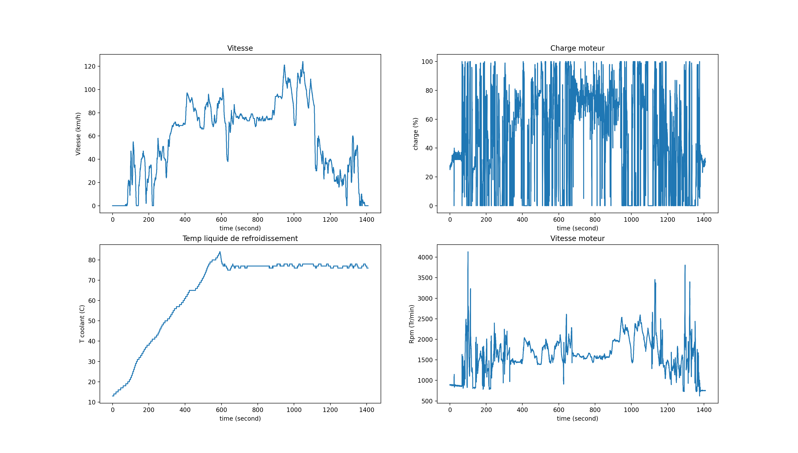

# Car-logger

### Description

Python project using OBD library to log all data from a vehicle sensors through the OBD II port.
These data can be further analyzed and be nicely output to a png file.


### Installation
```bash
python3 -m pip install obd
python3 -m pip install matplotlib
python3 -m pip install statistics
```
If you can't connect to the OBD, you must add dialout to your user :
```bash
sudo adduser $USER dialout
```

### Running the logger
```bash
python3 car_logger.py
```
### Running the parser
```bash
python3 log_reader.py
```


### Example output



### TO DO

- [ ] Add args for log_file location
- [ ] Add tutorial for runnning script at boot time
- [ ] Add fancy images
- [ ] Add hardware setup for logging
